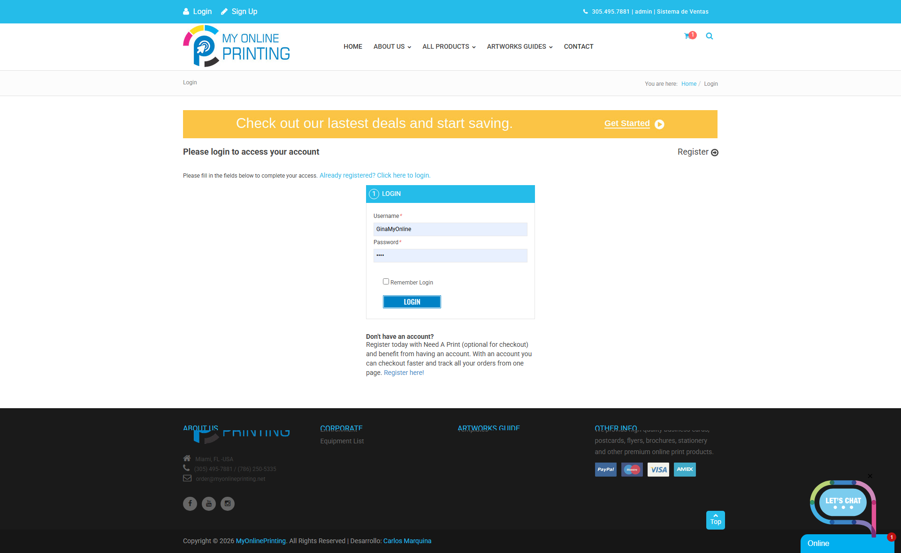
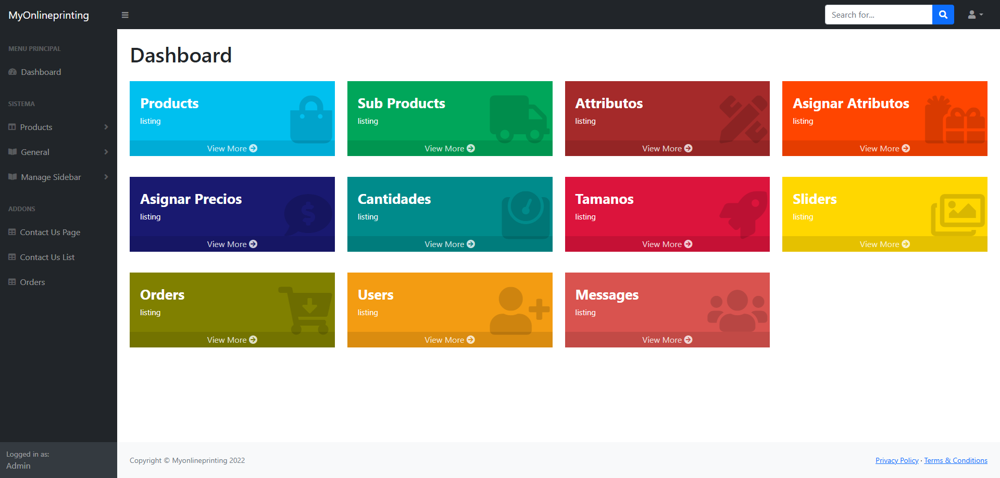

# My Online Printing 🖨️✨

**My Online Printing** es una plataforma web dinámica orientada al sector de imprenta y artes gráficas, diseñada para facilitar la visualización, cotización y gestión de servicios publicitarios (Postcards, Tickets, Folders, Envelopes, entre otros). El sistema está optimizado para ofrecer una navegación rápida y una experiencia de usuario fluida mediante el procesamiento de datos en segundo plano.

---

## 🚀 Características Principales

* **Catálogo Digital Interactivo:** Presentación estructurada de productos de impresión con interfaces limpias y dinámicas.
* **Procesamiento Asíncrono (AJAX):** Consultas, validaciones y envíos de formularios optimizados en tiempo real sin recargar la página.
* **Gestión de Archivos Avanzada:** Integración con CKFinder y CKEditor para una administración multimedia robusta y segura desde el backend.
* **Estructura Limpia y Segura:** Configuración avanzada de enrutamiento y protección de entornos mediante archivos `.htaccess` optimizados.

---

## 🛠️ Stack Tecnológico

* **Backend:** PHP 8.0+
* **Framework:** CodeIgniter 3 (Arquitectura MVC)
* **Frontend:** HTML5, CSS3, JavaScript (Librerías AJAX / jQuery)
* **Editor Multimedia:** CKFinder & CKEditor Core
* **Servidor/Entorno:** Apache / XAMPP Stack

---

## 📸 Capturas de Pantalla (Vista Previa)

### 🖥️ Portal Público y Flujo de Compra
| Vista Principal (Home) | Catálogo de Productos |
|---|---|
|  |  |

| Detalle del Producto | Carrito de Compras |
|---|---|
|  |  |

| Servicios de Impresión |
|---|
|  |

### 🔐 Panel Administrativo (Backend)
| Acceso (Login) | Panel de Control (Dashboard) |
|---|---|
|  |  |

| Perfil de Usuario |
|---|
|  |

## 📁 Estructura del Proyecto

El repositorio mantiene una estructura desacoplada del peso muerto de dependencias locales para garantizar un despliegue ágil:

* `/application`: Contiene los Controladores, Modelos y Vistas que manejan la lógica del negocio y las peticiones AJAX.
* `/assets`: Recursos estáticos del sitio (CSS, JS, Imágenes y plugins de edición).
* `/system`: Núcleo del Framework CodeIgniter.
* `.htaccess`: Configuración de reescritura de URLs para remover el `index.php` y proteger dominios adyacentes.

---

## 🔧 Instalación y Despliegue Local

1. Clona este repositorio en tu directorio local (ej. `xampp/htdocs/`):
   ```bash
   git clone [https://github.com/karlosystem/myonlineprinting-codeigniter.git](https://github.com/karlosystem/myonlineprinting-codeigniter.git)
